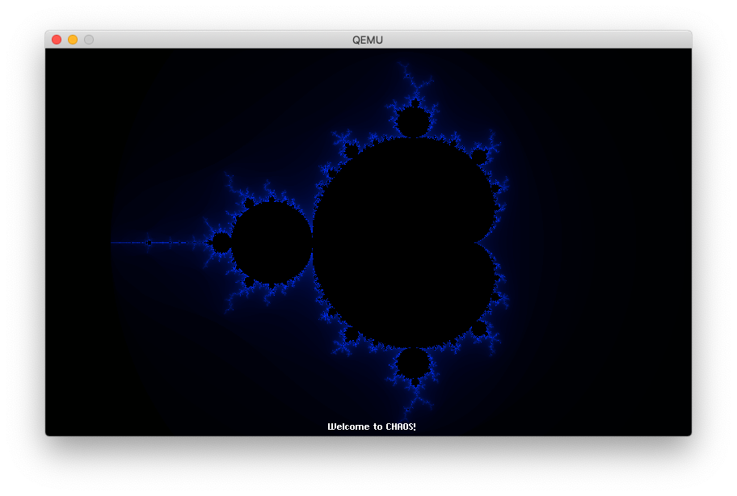

# CHAOS (CHeers, Another Operating System) - Raspberry Pi version

CHAOS Pi is a simple, 64-bit operating system for the Raspberry Pi currently in development.

Even though a large part can be run in QEMU, CHAOS has specifically been written for the following hardware (I purchased a [Touchscreen Starter Kit](https://www.amazon.com/gp/product/B07DTZ5LC8/ref=ppx_yo_dt_b_asin_title_o02_s00?ie=UTF8&psc=1)):

- Raspberry Pi 3 Model B+
- Official Raspberry Pi 7" Touchscreen

## Features

CHAOS right now offers minimum functionalities:

- Touchscreen support, whether single tap, swiping or pinching in and out (an UART keyboard input is used when QEMU is used)
- A heap management system (`malloc()` and `free()`, pages allocation)
- Fixed and proportionally-spaced fonts
- Partial FAT32 filesystem support
- Handling of CPU exceptions (and displays debbuging information in case a crash occurs)
- Virtual memory by programming the MMU (in progress)
- The ability to execute some code in user mode and access I/O through system calls (in progress)
- A basic Application Launcher, allowing to start apps which can interact with the touchscreen. Right now four apps are available:
    - A Mandelbrot app (see below)
    - A Filesystem app which looks at the FAT32 partitions on the SD card and displays the content of the first partition's root directory
    - A Kernel Heap app, which allows to examine the system heap
    - A Memory app, which allows to examine areas in the system's memory
    - A Fractal fern app (see below)

Pressing the lower left corner (or the Esc key if using QEMU) will switch back to the App Launcher.

## Mandelbrot App

The Mandelbrot app displays the Mandelbrot Set and provides the following features:

- It is using the touchscreen 800x480 resolution using the [RPi graphical mode](mailbox.md)
- It uses the RPi's 4 cores to compute the set in parallel in order to go faster. That part is working when using qemu.
- It takes advantage of the 7" touchscreen (see more details [here](touchscreen.md))
    - Swipe to navigate
    - Pinch to zoom in or out
    - Swipe up or down on the left hand side to change the maximum number of iterations
    - Tap on the top right end corner to return to the initial zoom
    - Tap on the bottom left end corner to quit the app to return to the main menu
- It has its own fixed-size and proportional fonts as well as an memory hex viewer (both on the screen or on the UART) for debugging purposes

## Fern App (User Mode)

The Fern app displays the Barnsley fractal Fern. Its main purpose is to showcase how code can be executed in EL0 (Exception Level 0) a.k.a. in user mode. It displays the wallpaper and draws each single point using a system call.

## Thanks

This project has been possible thanks to the numerous resources available on the Internet:

- [Bare Metal Programming on Raspberry Pi 3](https://github.com/bztsrc/raspi3-tutorial)
- [My public Baremetal Raspberry Pi code](https://github.com/LdB-ECM/Raspberry-Pi)
- [Raspberry Pi's Bare Metal forum](https://www.raspberrypi.org/forums/viewforum.php?f=72)
- And of course [OSDev.org](http://wiki.osdev.org/Main_Page)
