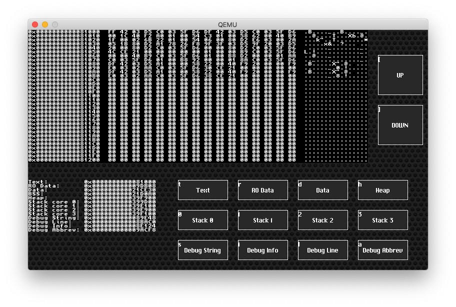

# User Interface and Applications

The current system runs one application at a time. No multitasking yet, whether cooperative nor preemptive. Instead, it relies on events to drive apps.

Each application needs to provide several callback functions:

- A load function, which is where the app's main allocation is done. This function is only called once - when the Launcher first calls the app
- A wake-up function, which is used anytime the menu needs to switch to the app
- The four Touchscreen callbacks: `first_touch()`, `swipe()`, `first_pinch()` and `pinch()`
- A `process_touch_event()` function, called when a touch event completed, i.e. the user lifts the finger(s) off the screen.

On top of that, each application has a `UserInterface` structure, currently used to keep track of buttons that the app can display on the screen (`UI_add_button()`, `UI_add_button_x_y()`). Because of the ease of testing the kernel in QEMU, the buttons are assigned a hotkey that can be pressed in the terminal window (through UART). When the kernel detects that QEMU is used, hotkeys are enabled and displayed on the top end of the buttons, as shown below in the Memory app:

The App Launcher will call the Touchscreen driver's `touchscreen_poll()` function, which will call the application callbacks if need be and return once a touch event completed. If the applicaton has some buttons defined, the Launcher will instead let the user interface handle the touchscreen, calling the button's callback functions if they are pressed.

If the touch event is an EXIT event (the user touched the lower left corner of the screen), then the App Launcher displays the main menu. If not, it calls the app's `process_touch_event()` callback function and repeats the procedure.
